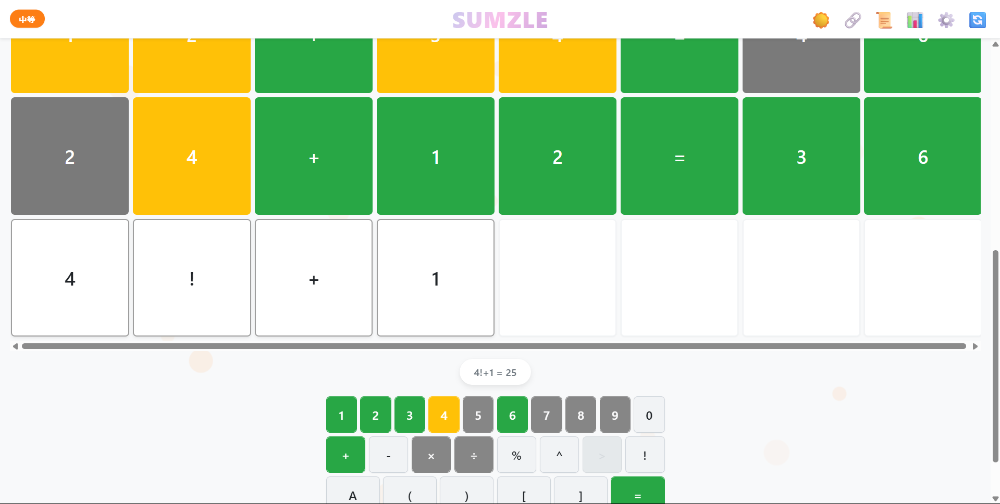

# Sumzle

Sumzle is a web-based puzzle game inspired by Wordle, but with a numerical twist! Challenge yourself to solve the sums in as few guesses as possible, track your stats, and share your results with friends.


## Features

- **Interactive Gameplay:** Solve daily or random puzzles directly in your browser.
- **Responsive Design:** Optimized for both desktop and mobile devices.
- **Difficulty Levels:** Choose from easy, medium, or hard puzzles.
- **Visual Feedback:** Tiles indicate correctness and position, similar to Wordle.
- **Keyboard & Touch Support:** Play using your keyboard or on touch devices.
- **Statistics & Sharing:** View your stats, track progress, and share your results.
- **Dark Mode:** Switch between light and dark themes for comfortable play.

## How to Play

1. Enter your guess for the sum in the tiles provided.
2. Each guess will give you feedback:
   - **Green**: Correct number in the correct place.
   - **Yellow**: Correct number in the wrong place.
   - **Gray**: Number not used in the sum.
3. Use the feedback to deduce the correct solution within the allowed number of guesses.

## Getting Started

### Online

Just open [https://SUSTechHSAS.github.io/Sumzle/](https://SUSTechHSAS.github.io/Sumzle/) in your browser!

### Local

1. Clone this repository:
    ```bash
    git clone https://github.com/SUSTechHSAS/Sumzle.git
    ```
2. Open `Sumzle.html` in your favorite web browser.

No build step is required; everything runs in the browser.

## Project Structure

```
Sumzle/
├── Sumzle.html     # Main application file
├── (other assets)
```

## Technologies Used

- HTML5, CSS3
- [Chart.js](https://www.chartjs.org/) for statistics
- [html2canvas](https://html2canvas.hertzen.com/) for sharing features

## Contributing

Pull requests are welcome! For major changes, please open an issue first to discuss what you would like to change.

## License

[MIT](./LICENSE)

---

> © SUSTechHSAS. Inspired by Wordle and number-based logic puzzles.

---
